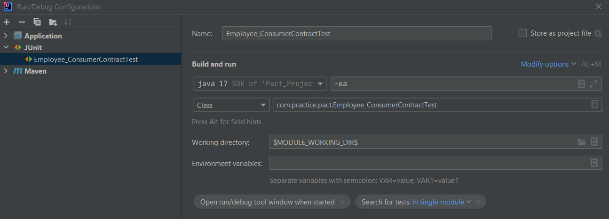

**Introduction**:

Contract testing is a very important and integral part of testing microservices.
It is an agreement between the producer/provider and the consumer of web/micro services,
that establish rules for permitted operations, data exchange, responses, and security.
The data exchange must follow a specification, known as schema, which defines the data
types, data structures and object hierarchies. Popular data exchange formats are
XML and JSON.

**Aim of this project**:

Providing a platform to learn Contract Testing, using Java, SpringBoot, Junit and PACT.
Always refer to the official site for latest documentation on PACT and its newly
released libraries. The same principle applies for Java and SpringBoot.
The test classes cover 3 different but important styles of running the tests, using:
1. MockServer
2. RestController method with MockMvcTestTarget
3. SpringBootTest

**Project structure:**

This project is created as maven project, so it follows typical maven project structure
for any java projects.

**Pre-requisites:**

1. Good knowledge of Java programming language
2. Moderate knowledge of SpringBoot (Java) microservices and annotations
3. Working knowledge of RestAssured
4. Working knowledge of MySql
5. Working knowledge of Junit
6. Working knowledge of Git

**How to run the tests:**

First clone the project using Git. Next open it in your preferred IDE. Allow sometime
 to build the project. Once done you are ready to explore the test classes and the 
microservices created under src.main.java package. Kindly read through the codes 
under src.main.java and src.test.java packages to develop idea about the application
 under test and how PACT is used to do Contract testing.

Before running the SpringBoot application or test classes, make sure to install MySql
from their official website, and then configure the below-mentioned application properties
under src.main.resources folder:

`spring.datasource.username=root

spring.datasource.password= <Give your MySQL's root user password>`

My preferred IDE is IntelliJ, so I will explain how to configure the Junit run configurations.
You need to create a new Junit run configuration as follows, just specify the test class name.

